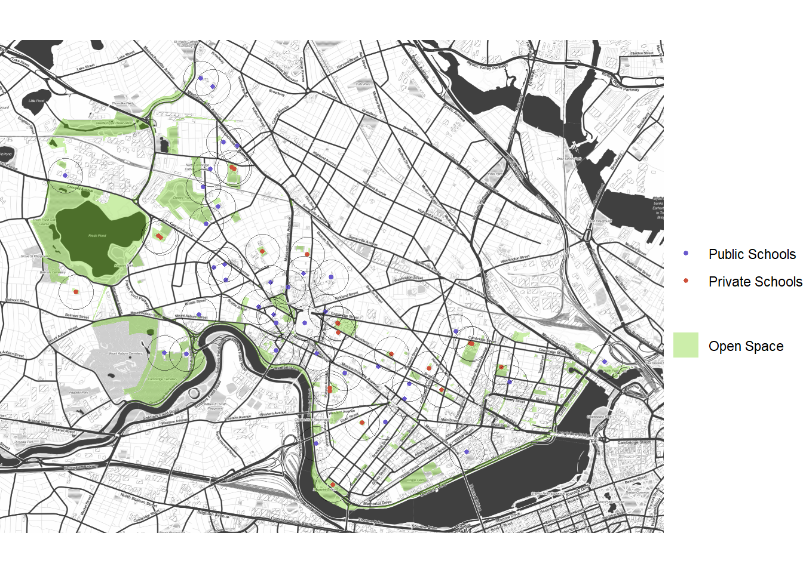

```{r setup, include=FALSE}
knitr::opts_chunk$set(echo = TRUE)
```

# Introduction

Your portfolio should demonstrate each of the following skills:

* Displaying multiple vector layers on the same map
* Calculating and displaying relationships among point and polygon layers based on distance
* Aggregating point data to a layer of polygons
* Calculating and displaying accessibility, based on travel time
* Converting between raster layers and vector layers
* Displaying raster data on a map
* Georeferencing a raster image
* Displaying data on an interactive map

# Cambridge, MA
This map of Cambridge, MA visualizes multiple vector layers: open space and schools in the town. 

[](https://madeleinelevin.github.io/spatialportfolio/PDFs/CambridgeMap.pdf){target="_blank"}


# Mumbai, India
For an assignment on Georeferencing, a map of Mumbai from 1960 was brought into conversation with both historical and more recent data about the city.

## Historical Administrative Boundaries

[](https://madeleinelevin.github.io/spatialportfolio/PDFs/CambridgeMap.pdf){target="_blank"}


## Current Population Density

[](https://madeleinelevin.github.io/spatialportfolio/PDFs/CambridgeMap.pdf){target="_blank"}


# Philadelphia, PA

# Portland, OR
