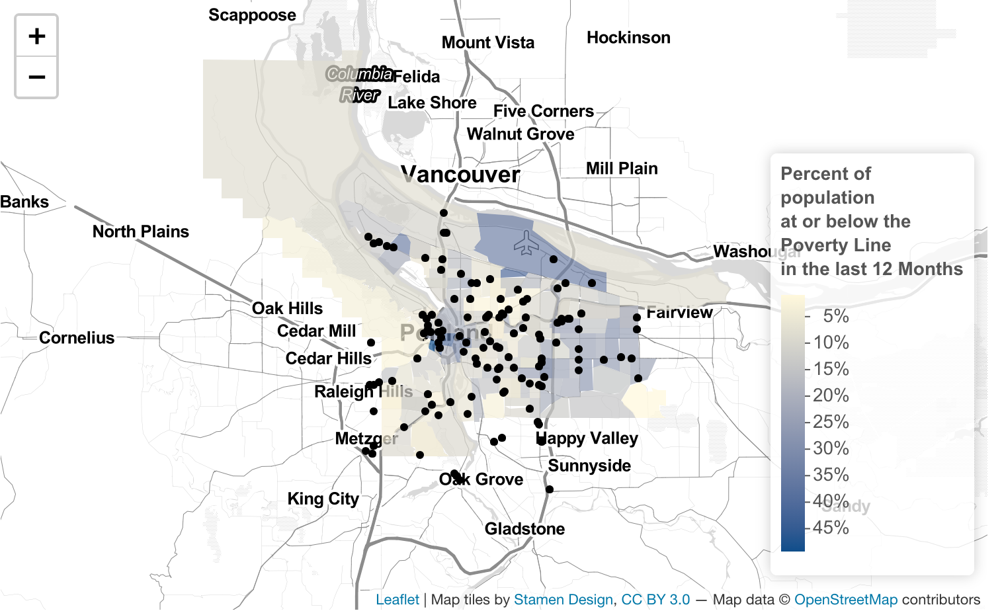

```{r setup, include=FALSE}
knitr::opts_chunk$set(echo = TRUE)
```

# Introduction

This portfolio shows a series of maps created in R (except for the maps of Mumbai which were created in QGIS) demonstrating the following skills:

* Displaying multiple vector layers on the same map

* Calculating and displaying relationships among point and polygon layers based on distance

* Aggregating point data to a layer of polygons

* Calculating and displaying accessibility, based on travel time

* Converting between raster layers and vector layers

* Displaying raster data on a map

* Georeferencing a raster image

* Displaying data on an interactive map

The maps cover a range of cities and display data pulled from historical maps, OpenStreetMaps, local open data sources, US Census data, and more. 

# Cambridge, MA

Skills shown: Displaying multiple vector layers on the same map

This map of Cambridge, MA visualizes multiple vector layers: open space and schools in the town. 

[](https://madeleinelevin.github.io/spatialportfolio/PDFs/CambridgeMap.pdf){target="_blank"}


# Mumbai, India
Skills shown: Displaying raster data on a map; Georeferencing a raster image

For an assignment on Georeferencing, a map of Mumbai from 1960 was brought into conversation with both historical and more recent data about the city.

## Historical Administrative Boundaries
This map overlays administrative boundaries of Mumbai (Bombay at the time) from 1931, 1955, and 1968 on a map from 1960. This visualizes the physical growth of the city over several decades, especially along the waterfront where infill created new land. 

[](https://madeleinelevin.github.io/spatialportfolio/PDFs/C1960_MumbaiAdminBoundaries.pdf){target="_blank"}


## Current Population Density
Today, the size of Mumbai is much larger than the boundaries of the historical map and sprawl extends beyond city limits. This is demonstrated in this point population density layer where a zoomed out inset map is needed to show just how far the urban area of Mumbai extends.

[](https://madeleinelevin.github.io/spatialportfolio/PDFs/Mumbai_PopulationDensity.pdf){target="_blank"}


# Philadelphia, PA
These two maps look at bike share stations and bike crashes in Philadelphia, PA.
[Open Data Philly]( https://www.opendataphilly.org/). 

## Neighborhoods by Number of Bike Share Stations
Skills shown: Aggregating point data to a layer of polygons

This first map shows that the Philadelphia's bike share system remains concentrated in the downtown area. In fact, only 22% of Philadelphia neighborhoods have bike share stations. However, bike crashes (as shown in the next map) and thus bike ridership, occur throughout the city.

[](https://madeleinelevin.github.io/spatialportfolio/PDFs/Mumbai_PopulationDensity.pdf){target="_blank"}

## Bike Crashes by Distance to Bike Share Station

Skills shown: Calculating and displaying relationships among point layers based on distance

While the average bike crash happened over 2000 meters from a bike share station, we can see that the city center, which is also where most bike share stations are located, had a higher density of crashes. Comparing this data to population and traffic density might help provide a fuller picture.

[](https://madeleinelevin.github.io/spatialportfolio/PDFs/Mumbai_PopulationDensity.pdf){target="_blank"}

# Portland, OR
This series of maps explores food access in Portland, Oregon. It uses transit data, grocery store data points, and poverty status to identify the neighborhoods in Portland with the most need for greater grocery store access. 

## Grocery Store Transit Accessibility
Skills shown: calculating and displaying relationships among point and polygon layers based on distance; Calculating and displaying accessibility, based on travel time

This map uses the Trimet data to estimate the amount of time it takes to reach a grocery store on public transit. Most areas are within a 20 minute journey to the grocery store, but pockets, especially on the edges of the city, take longer.

[](https://madeleinelevin.github.io/spatialportfolio/PDFs/Mumbai_PopulationDensity.pdf){target="_blank"}

## Grocery Store Walking Accessibility 
Skills shown: Calculating and displaying accessibility, based on travel time, Converting between raster layers and vector layers

The following two maps (the first a vector, the second a raster) visualize the same Walking Accessibility Scores. Very few neighborhoods in Portland are accessible on foot to grocery stores. 

Vector:

[](https://madeleinelevin.github.io/spatialportfolio/PDFs/Mumbai_PopulationDensity.pdf){target="_blank"}

Conversion to Raster:
Skills shown: Displaying raster data on a map

[](https://madeleinelevin.github.io/spatialportfolio/PDFs/Mumbai_PopulationDensity.pdf){target="_blank"}


## Interactive Map- Grocery Stores and Poverty
Skills shown: Displaying data on an interactive map

This final interactive map compares grocery store locations with poverty rates from the 2019 ACS Community Survey 5-Year Estimates. This map, used with the prior accessibility maps, can help identify neighborhoods that are the most in need of increased affordable food access.

Click the image to explore the interactive map.
 [](https://madeleinelevin.github.io/spatialportfolio/PDFs/PDXPoverty2019_Grocery.html){target="_blank"}

